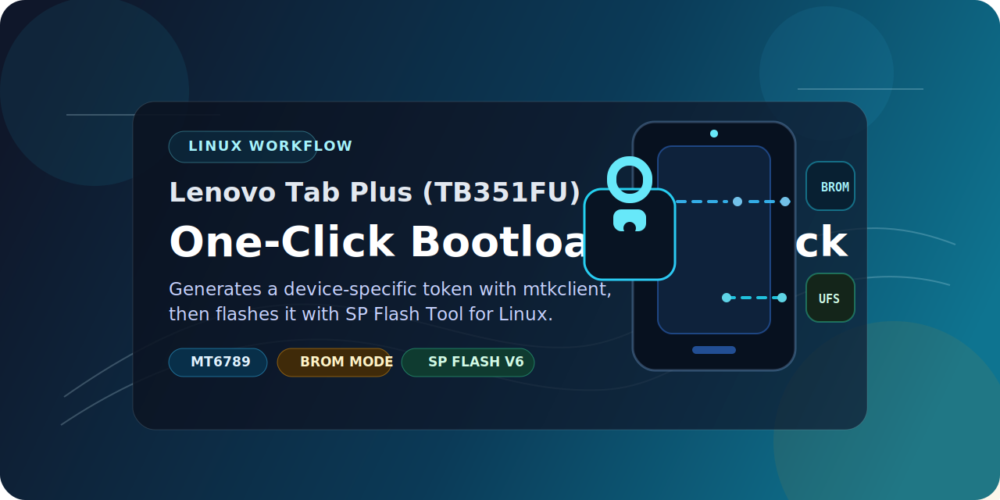

<p align="center">
  
</p>

<h1 align="center">Lenovo Tab Plus (TB351FU) One-Click Bootloader Unlock</h1>

<p align="center">
  A Linux-first helper that automates a two-stage MediaTek bootloader unlock workflow for the Lenovo Tab Plus <code>TB351FU</code> using <code>mtkclient</code> and <code>SP Flash Tool v6</code>.
</p>

> [!NOTE]
> TB351FU DevHub link for users who want to all the development related links in one place including custom roms and recovery [TB351FU_Dev_HUB](https://helllopratik.github.io/tb351fu/).

<p align="center">
  <strong>TB351FU only</strong> • <strong>MT6789 / Helio G99</strong> • <strong>Linux workflow</strong> • <strong>Experimental</strong>
</p>

> [!WARNING]
> This project performs low-level bootloader-related operations and may wipe data or brick the device if used incorrectly. It is intended for the Lenovo Tab Plus `TB351FU` only. Back up device-unique partitions such as `nvram`, `nvdata`, and `proinfo` before attempting anything.

> [!NOTE]
> This repository is not affiliated with Lenovo or MediaTek. Proprietary device files are not included here and must be supplied by the user.

> [!TIP]
> Lenovo's official `TB351FU` firmware package is encrypted. To generate the required files for `assets/` from official firmware, use [lenovo_flash_xml_helper_TB351FU](https://github.com/helllopratik/lenovo_flash_xml_helper_TB351FU/tree/main).

## Overview

Many MediaTek devices do not unlock cleanly with a simple fastboot command alone. This project wraps a hybrid process into one guided Linux script:

1. `mtkclient` talks to the tablet in BROM mode and generates a device-specific unlock token.
2. Linux `SP Flash Tool v6` uses your supplied auth and flash files to write the required unlock data.
3. You reboot into fastboot and verify the unlocked state.

The goal is to reduce repeated manual steps while keeping Lenovo-specific firmware components out of the repository.

## Highlights

- Built specifically for Lenovo Tab Plus `TB351FU`
- Interactive two-stage flow with clear prompts
- Uses bundled `mtkclient/` and `spflash/` directories already included in this repo
- Keeps proprietary Lenovo files out of version control
- Designed around a Linux host workflow

## How It Works

### Stage 1: Token generation

The script runs `mtkclient` in DA/BROM mode and attempts to generate a hardware-specific unlock token for the connected tablet.

- Tool used: `mtkclient`
- Expected output: `generated_unlock_token.bin`
- Connection method: powered-off tablet + `Volume Up` BROM handshake
- Shortcut: holding `Volume Up` while plugging in the charging or USB cable should boot directly into BROM on `TB351FU`

### Stage 2: Flashing

After you disconnect and reset the device, the script launches Linux `SP Flash Tool v6` with your supplied `flash.xml` and `da.auth`.

- Tool used: `spflash/SPFlashToolV6.sh`
- Input files: files placed in `assets/`
- Goal: write the unlock-related data to the correct storage target

## Repository Layout

| Path | Purpose |
| --- | --- |
| `one_click_unlock.py` | Main wrapper script |
| `assets/` | Place required device-specific files here |
| `mtkclient/` | Bundled upstream MediaTek tooling |
| `spflash/` | Bundled Linux SP Flash Tool package |
| `LICENSE` | MIT license for this wrapper project |

## Required Files

This repository intentionally ships with an empty `assets/` directory. Before running the script, place the following files there:

| File | Why it is needed |
| --- | --- |
| `da.auth` | Authentication file used during flashing |
| `DA_BR.bin` | Download agent used by the workflow |
| `MT6789_Android_scatter.xml` | Device scatter definition |
| `flash.xml` | SP Flash Tool flashing manifest |

Because the official Lenovo firmware for this model is encrypted, you may need to generate these files first. The recommended helper repository is [lenovo_flash_xml_helper_TB351FU](https://github.com/helllopratik/lenovo_flash_xml_helper_TB351FU/tree/main).

## Prerequisites

- A Linux system with USB access
- `python3` and `pip`
- `libusb-1.0`
- A reliable USB cable connected directly to the computer
- A powered-off Lenovo Tab Plus `TB351FU`
- `sudo` access

Example setup:

```bash
python3 -m venv venv
source venv/bin/activate
sudo apt update
sudo apt install -y python3 python3-pip python3-cryptography libusb-1.0-0
sudo systemctl stop ModemManager
python3 -m pip install -r mtkclient/requirements.txt
```

If your distro enforces PEP 668 restrictions, install the Python dependencies inside a virtual environment or use your distro's packaged equivalents.

## Quick Start

1. Place the required files in `assets/`.
2. Make sure the tablet is unplugged and fully powered off.
3. Run the unlocker:

```bash
sudo ./venv/bin/python3 one_click_unlock.py
```

4. Follow the on-screen prompts for both connection stages.
5. When the process finishes, power the tablet off, boot to fastboot, and verify:

```bash
fastboot getvar unlocked
```

Fastboot on `TB351FU`:

- Hold `Volume Down` + `Power` from power-off

## Video Guide

If you want a visual walkthrough for the flashing part of this workflow, use this video guide:

- [How to flash the bootloader on Lenovo Tab Plus TB351FU](https://www.youtube.com/watch?v=SAwgAutwB2s&t=374s)

## Boot Modes And Button Combos

| Action | Key combo |
| --- | --- |
| BROM mode | Hold `Volume Up`, then plug in USB or charger |
| Recovery | Hold `Volume Up` + `Volume Down`, then press `Power` |
| Force reset | Hold `Power` + `Volume Down` for about 20 to 25 seconds |
| Fastboot | Hold `Volume Down` + `Power` from power-off |

On this tablet, if the device is powered off and you keep `Volume Up` pressed while plugging in the charging or USB cable, it should boot into BROM automatically.

## Notes and Limitations

- This workflow is written for the Lenovo Tab Plus `TB351FU` and should not be assumed safe for other MediaTek devices.
- `assets/` is intentionally empty because Lenovo-specific files are not redistributed here.
- The wrapper expects the generated token file to appear as `generated_unlock_token.bin` in the repository root.
- USB stability, firmware version, auth file compatibility, and host distro differences can affect the outcome.

## Acknowledgements
 - Maintainer: `Pratik Gondane (@helllopratik)`
 - Device: `Lenovo Tab Plus (2024) TB351FU`

Special thanks to:

- `mtkclient` for the MediaTek research and tooling behind the token-generation stage
- `SP Flash Tool v6` for Linux for the flashing stage used in this workflow

This repository is a thin automation layer around those tools so the same unlock routine is easier to repeat.

## License

The wrapper project in this repository is released under the MIT License. Bundled third-party tools inside `mtkclient/` and `spflash/` remain under their own licenses, notices, and ownership.
